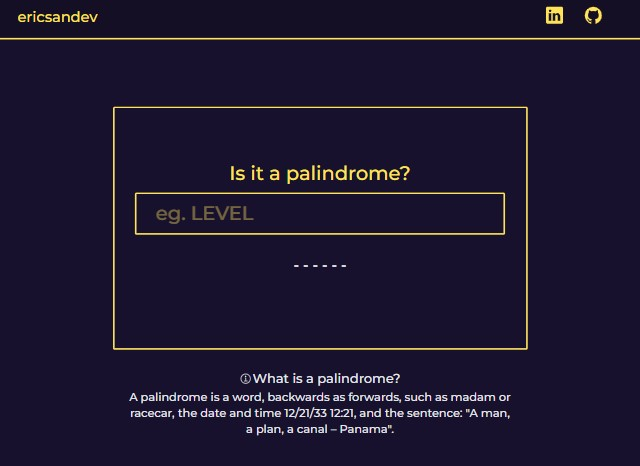

# Checking Palindromes

The `isPalindrome` function is a utility used to check if a text string is a palindrome. This readme provides information on how to use this feature and its functionality.

## Description

A text string is considered a palindrome if it reads the same both ways, that is, if it remains unchanged when reversed. The `isPalindrome` function takes a text string as input and performs the following steps to determine if it is a palindrome:

1. Clean the string: Remove all non-alphanumeric characters and convert the string to lowercase.

2. Reverse the chain.

3. Compare the original string with the inverted string. If they are identical, the function returns `true`, indicating that the string is a palindrome. Otherwise, it returns `false`.

## Use

To use the `isPalindrome` function, follow these steps:

1. Make sure the function is imported correctly into your app or module.

    ```javascript
   import { isPalindrome } from '../utils/isPalindrome';
    ```

2. Call the `isPalindrome` function and pass it the text string you want to verify as an argument.

    ```javascript
    const result = isPalindrome('aniline');
    ```

3. The function will return `true` if the string is a palindrome and `false` if it is not.

    ```javascript
    if (result) {
      console.log('It is a palindrome');
    } else {
      console.log('Not a palindrome');
    }
    ```

## Example of Use

```javascript
import { isPalindrome } from './path-to-module/isPalindrome';

const text1 = 'aniline';
const text2 = 'hello';

console.log(isPalindrome(text1)); // returns true
console.log(isPalindrome(text2)); // Returns false
```

## Dependencies

The `isPalindrome` function has no external dependencies and is independent, making it easy to integrate into JavaScript projects and Node.js applications.